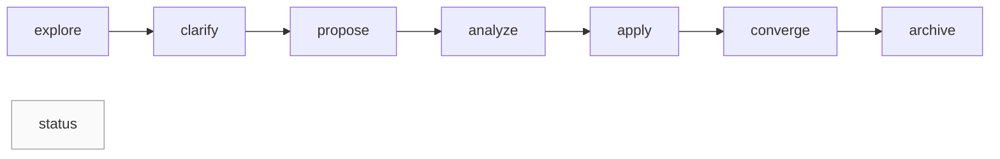

# Specmark — 规格驱动变更工作流

> 面向 AI agent 的规格驱动变更（spec-driven change）管理 skill：八阶段状态机覆盖探索→澄清→提案→分析→实施→收敛→归档→状态查询，阶段判定由确定性脚本完成，不由模型手算。

[](https://github.com/Kirky-X/specmark/releases) [](https://github.com/Kirky-X/specmark/releases) [](LICENSE)

中文 | [English](README_EN.md)

## ✨ 功能特性

- **八阶段状态机**：`explore`（只读探索）→ `clarify`（结构化澄清，≤5 高影响问题、8 分类扫描）→ `propose`（一步生成 proposal + design + tasks）→ `analyze`（跨产物一致性只读质量门）→ `apply`（按 tasks.md 逐条实施）→ `converge`（对比交付物与 spec，append-only 补缺）→ `archive`（归档）→ `status`（只读状态查询），支持 `$ARGUMENTS[0]` 路由与自然语言意图触发
- **自动执行链 + 两段式复杂度短路**：阶段间自动衔接；链启动时 agent 启发式预判（显式标注），propose 后 `check_phase.sh complexity` 三档确定性判定（simple/medium/complex），不一致时硬规则补跑 analyze；用户可显式覆盖
- **长程变更自动生成 delta spec**：任务数 ≥5 或跨 ≥3 模块时在 `specs/<capability>/spec.md` 生成可验证需求规格；`archive --sync` 经 `merge_delta_spec.py` 确定性合并回主规格
- **6 种领域类型（domain）**：code / doc / event / design / research / general，决定任务格式、apply 策略与 converge 验证方式，proposal 头部 `<!-- domain: <type> -->` 声明
- **确定性脚本（规则 3）**：任务计数（含 `[~]` 阻塞态）、三档复杂度、归档就绪、阶段推断、引用与产物 lint 统一实现在 `scripts/specmark_state.py`（单一谓词源），判定不过时输出 `remedy` 补救指引，禁止模型手动读文件计算
- **ROOT 契约**：脚本从用户项目 cwd 调用，`--root` 缺省时自动取调用方所在 git 仓库顶层
- **归档保护**：change 级 fcntl 进程锁（跨平台）+ commit SHA 锚定 + `.readonly` 哨兵 + 拒绝覆盖同名归档 + 未完成任务硬门禁（`--allow-unfinished` 显式豁免并写快照）；`--dry-run` 预览；误归档 `restore` 子命令原子恢复
- **安全阀**：analyze 有 CRITICAL/HIGH 发现时暂停链路等待用户决策；converge 收敛轮数（脚本 `convergence_rounds` 计数）超过 3 硬停止；`apply --auto-commit` 每任务自动 git commit（只提交代码改动，默认关闭）

## 📦 安装

无外部 CLI 依赖（纯文档型 skill；确定性脚本仅需 bash 与 python3）。

**平台支持**：Linux / WSL2 / macOS（实测于 WSL2；macOS 依赖 POSIX fcntl，理论可用未经实测）；Windows 原生暂不支持归档/恢复（fcntl 不可用，状态查询类子命令可用）。

```bash
# 方式一：从本工作区统一部署（部署到 ~/.zcode/skills 与 ~/.claude/skills）
bash scripts/sync-skills.sh specmark

# 方式二：手动复制到 ZCode 技能目录
cp -r /path/to/specmark ~/.zcode/skills/specmark

# 方式三：远程安装（GitHub 仓库），支持 claude-code / codex 等 agent
npx skills add Kirky-X/specmark --agent claude-code -y
# 或使用仓库自带安装器（支持 9 种 agent）
git clone https://github.com/Kirky-X/specmark && cd specmark
./scripts/install-skill.sh install specmark --agent claude
```

升级重装时，安装器会保护运行时数据：若目标位置 `specmark/changes/` 非空，自动搬移为 `changes.bak.<时间戳>/`，不静默删除活动变更。

## 🚀 快速开始

前置条件：skill 已安装并被 agent 加载（对话中以 `/specmark` 调用）。

```text
/specmark explore            # 只读探索：梳理想法、对比选项，不写应用代码
/specmark propose add-auth   # 生成 proposal + design + tasks（长程变更含 delta spec）
/specmark apply              # 按 tasks.md 逐条实施，遇阻 PAUSE
/specmark status             # 查看活动变更、进度与归档概览
```

确定性脚本也可从用户项目根目录直接调用（`$SKILL` 为 skill 安装目录）：

```bash
bash $SKILL/scripts/status.sh                            # 全局状态（--json 可选）
bash $SKILL/scripts/check_phase.sh tasks add-auth        # 任务完成计数（JSON）
python3 $SKILL/scripts/check_refs.py --root .            # 跨文件引用一致性 lint
```

阶段协作链路：



非强制线性：clarify / analyze / converge 可按需跳过，自动链有短路规则与失败模式处理，详见 [SKILL.md](SKILL.md) 与 `references/<子命令>.md`。

## ✅ 测试与验证

2026-09-30 实测（v0.2.3 工作区，本轮优化后）：

- **测试套件**：`python3 -m unittest discover -s tests` —— **53 个用例全部通过**，覆盖：
  - 单一谓词源：任务四态解析、阶段推断规则表、三档复杂度、next_command 路由、ROOT 解析
  - 薄入口子进程：check_phase.sh 五子命令期望输出、`--root` 任意参数位、`--json` 静默、退出码 0/1/2、remedy 字段
  - 归档全链路：完整性与 `--allow-unfinished` 豁免快照、`--sync` 合并主 specs、`.specmark-version` 版本戳、拒绝覆盖、dry-run 不动文件、restore 往返与同名冲突/歧义、fcntl 锁竞争退出码 2
  - check_refs 两模式：项目模式占位符/ID/优先级/路径检查、skill 模式本仓库零发现、`--root` 弃用提示
  - merge_delta_spec：ADD/MODIFY/DELETE/KEEP 语义与二次合并字节级幂等
  - 文档字节预算 ratchet（SKILL.md ≤20KiB、references ≤40KiB）
- **语法检查**：4 个 `.sh` `bash -n` 通过；3 个 `.py` `py_compile` 通过
- 平台说明：以上全部在 WSL2/Linux 实测；macOS 路径（fcntl）为理论支持未经实测；Windows 原生不支持归档/恢复
- `test-prompts.json` 保存各子命令触发语用例，用于验证路由正确性

## 📁 目录结构

```
specmark/
├── SKILL.md            # 入口：子命令路由 + 自动链 + 反模式黑名单
├── skill.json          # 元数据（name/version/license/repo）
├── references/         # 每个子命令的 Steps + Guardrails（10 个文件）
│   ├── explore.md … status.md
│   ├── explore-examples.md
│   └── troubleshooting.md
├── scripts/            # 确定性工具 + 安装器（判定统一实现在 specmark_state.py，.sh 为薄入口）
│   ├── specmark_state.py   # 单一谓词源：任务解析/阶段推断/三档复杂度/状态路由 + 归档恢复执行器（fcntl 锁）
│   ├── check_phase.sh      # 阶段完成判定（artifacts/tasks/converge/archive-readiness/complexity）
│   ├── status.sh           # 全局状态查询（含 next_command 确定性路由）
│   ├── check_refs.py       # 引用与产物 lint（--skill-root 查 skill 仓库；--project 查用户项目）
│   ├── archive_change.sh   # 归档/恢复执行器入口（fcntl 锁 + 只读强制 + 完整性门禁 + restore）
│   ├── merge_delta_spec.py # delta spec 确定性合并
│   └── install-skill.sh    # 多 agent 安装/更新（自动补脚本执行位）
├── tests/              # unittest 测试套件（unittest discover -s tests）
└── specmark/           # 运行时工作目录（changes/ specs/ archive/）
```

## 🔮 边界

- **不触发**：普通问答、无变更意图的直接代码生成。自然语言意图（如「帮我梳理思路」）会先经 AskUserQuestion 确认是否进入 explore，不自动路由
- **与兄弟 skill 分工**：`pangu` 负责项目脚手架与 CI 初始化；`diting` 负责代码质量审查；`tiangang` 负责安全扫描；specmark 只管变更过程本身（spec → 任务 → 实施 → 收敛 → 归档），不做构建、测试执行或质量判断
- **纯文档型**：所有变更管理操作通过 agent 文件系统工具完成，脚本仅做确定性判定

## 📄 License 与归属

MIT License。前身是 4 个独立顶层技能（`specmark-propose` / `specmark-explore` / `specmark-apply-change` / `specmark-archive-change`），已扁平合并为单一 skill，原 SKILL.md 内容迁入 `references/`。
