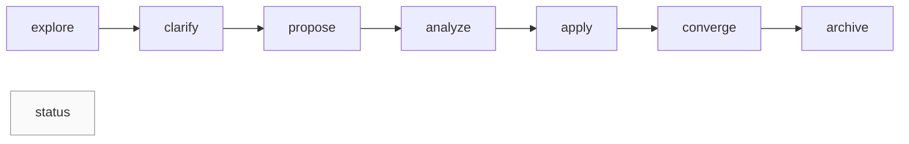

# Specmark — Specification-Driven Change Workflow

> A specification-driven change management skill for AI agents: an eight-stage state machine covering explore → clarify → propose → analyze → apply → converge → archive → status, with stage gating done by deterministic scripts instead of model guesswork.

[](https://github.com/Kirky-X/specmark/releases) [](https://github.com/Kirky-X/specmark/releases) [](LICENSE)

English | [中文](README.md)

## ✨ Features

- **Eight-stage state machine**: `explore` (read-only thinking) → `clarify` (structured clarification, ≤5 high-impact questions, 8-category scan) → `propose` (one-shot proposal + design + tasks) → `analyze` (read-only cross-artifact quality gate) → `apply` (execute tasks.md item by item) → `converge` (reconcile deliverables against spec, append-only gaps) → `archive` (archive) → `status` (read-only status query), routed via `$ARGUMENTS[0]` and natural-language intent.
- **Auto-execution chain with two-stage complexity short-circuit**: stages auto-link; a heuristic pre-judgment (explicitly labeled) at chain start, then a deterministic three-tier verdict (simple/medium/complex) from `check_phase.sh complexity` after propose; a hard rule re-runs analyze when the two disagree; the user can override explicitly.
- **Delta spec for long-running changes**: when tasks ≥ 5 or spanning ≥ 3 modules, a verifiable spec is generated at `specs/<capability>/spec.md`; `archive --sync` merges it back deterministically via `merge_delta_spec.py`.
- **6 domain types**: code / doc / event / design / research / general — they determine task format, apply strategy, and converge verification; declared via `<!-- domain: <type> -->` in the proposal header.
- **Deterministic scripts (Rule 3)**: task counting (including `[~]` blocked state), three-tier complexity, archive readiness, stage inference, and artifact lint are implemented once in `scripts/specmark_state.py` (single predicate source); failed checks emit a `remedy` hint, and hand-counting by the model is forbidden.
- **ROOT contract**: scripts run from the user project's cwd; `--root` defaults to the caller's git repository top level automatically.
- **Archive protection**: change-level fcntl process lock (cross-platform) + commit SHA anchoring + `.readonly` sentinel + refusal to overwrite an existing archive target + a hard completeness gate (`--allow-unfinished` exempts explicitly and records a snapshot); `--dry-run` preview; `restore` sub-command recovers mis-archived changes atomically.
- **Safety valves**: the chain pauses on CRITICAL/HIGH findings in analyze; converge hard-stops past 3 convergence rounds (script-counted via `convergence_rounds`); `apply --auto-commit` git-commits code changes after each task (off by default).

## 📦 Installation

No external CLI dependency (pure documentation skill; the scripts only need bash and python3).

**Platform support**: Linux / WSL2 / macOS (tested on WSL2; macOS relies on POSIX fcntl and is expected to work but untested); native Windows is not supported for archive/restore (no fcntl; query-only sub-commands work).

```bash
# Option 1: deploy from this workspace (to ~/.zcode/skills and ~/.claude/skills)
bash scripts/sync-skills.sh specmark

# Option 2: manual copy into the ZCode skills directory
cp -r /path/to/specmark ~/.zcode/skills/specmark

# Option 3: remote install from GitHub, for claude-code / codex and other agents
npx skills add Kirky-X/specmark --agent claude-code -y
# Or use the bundled installer (9 agents supported)
git clone https://github.com/Kirky-X/specmark && cd specmark
./scripts/install-skill.sh install specmark --agent claude
```

On reinstall/upgrade the installer protects runtime data: if the target `specmark/changes/` is non-empty it is moved to `changes.bak.<timestamp>/` instead of being silently deleted.

## 🚀 Quick Start

Prerequisite: the skill is installed and loaded by the agent (invoked as `/specmark` in conversation).

```text
/specmark explore            # Read-only exploration: think through ideas, no app code
/specmark propose add-auth   # Generate proposal + design + tasks (delta spec for long-running changes)
/specmark apply              # Execute tasks.md item by item; PAUSE when blocked
/specmark status             # View active changes, progress, and archive overview
```

The deterministic scripts can also be called from the user project root (`$SKILL` is the skill install directory):

```bash
bash $SKILL/scripts/status.sh                            # Global status (--json optional)
bash $SKILL/scripts/check_phase.sh tasks add-auth        # Task completion counts (JSON)
python3 $SKILL/scripts/check_refs.py --project .         # Active-change artifact lint (placeholders / task IDs / priorities / path existence)
```

Stage collaboration chain:



The chain is not strictly linear: clarify / analyze / converge can be skipped as needed; short-circuit rules and failure modes are documented in [SKILL.md](SKILL.md) and `references/<subcommand>.md`.

## ✅ Tests & Verification

2026-10-04, measured on the v0.2.5 working tree:

- **Test suite**: `python3 -m unittest discover -s tests` — **53 tests, all passing**, covering:
  - Single predicate source: four-state task parsing, stage inference table, three-tier complexity, next_command routing, ROOT resolution
  - Thin-entry subprocesses: check_phase.sh five sub-commands, `--root` in any position, `--json` silence, exit codes 0/1/2, remedy fields
  - Full archive chain: completeness gate & `--allow-unfinished` snapshot, `--sync` merge into main specs, `.specmark-version` stamp, overwrite refusal, dry-run moving nothing, restore round-trip with conflict/ambiguity cases, fcntl lock contention exit code 2
  - check_refs both modes: project-mode placeholder/ID/priority/path checks, skill-mode clean on this repo, `--root` deprecation hint
  - merge_delta_spec: ADD/MODIFY/DELETE/KEEP semantics and byte-identical idempotent re-merge
  - Docs byte-budget ratchet (SKILL.md ≤ 20 KiB, references ≤ 40 KiB)
- **Syntax**: 4 `.sh` pass `bash -n`; 4 `.py` pass `py_compile`.
- Platform note: everything above tested on WSL2/Linux; the macOS path (fcntl) is expected-but-untested; native Windows does not support archive/restore.

## 📁 Directory Structure

```
specmark/
├── SKILL.md            # Entry: subcommand routing + auto-chain + anti-pattern blacklist
├── skill.json          # Metadata (name/version/license/repo)
├── references/         # Steps + Guardrails per subcommand (10 files)
│   ├── explore.md … status.md
│   ├── explore-examples.md
│   └── troubleshooting.md
├── scripts/            # Deterministic tools + installer (logic lives in specmark_state.py; .sh files are thin entries)
│   ├── specmark_state.py   # Single predicate source: task parsing / stage inference / three-tier complexity / status routing + archive & restore executor (fcntl lock)
│   ├── check_phase.sh      # Stage gating (artifacts/tasks/converge/archive-readiness/complexity)
│   ├── status.sh           # Global status query (with deterministic next_command routing)
│   ├── check_refs.py       # Reference & artifact lint (--skill-root for the skill repo; --project for user projects)
│   ├── archive_change.sh   # Archive/restore entry (fcntl lock + read-only enforcement + completeness gate)
│   ├── merge_delta_spec.py # Deterministic delta spec merge
│   ├── skill_lint.py       # Skill-repo engineering baseline audit (frontmatter / JSON assets / version consistency / referenced paths + lint-checks.json gates)
│   └── install-skill.sh    # Multi-agent install/update (restores script exec bits)
├── tests/              # unittest suite (python3 -m unittest discover -s tests)
└── specmark/           # Runtime working directory (changes/ specs/ archive/)
```

## 🔮 Boundaries

- **Does not trigger**: plain Q&A or direct code generation with no change-management intent. Natural-language intent (e.g. "help me think this through") is first confirmed via AskUserQuestion before entering explore — no silent routing.
- **Sibling skills**: `pangu` scaffolds projects and CI; `diting` reviews code quality; `tiangang` runs security scans. Specmark only manages the change process itself (spec → tasks → apply → converge → archive); it does not build, run tests, or judge quality.
- **Pure documentation skill**: all change-management operations go through the agent's file-system tools; scripts only perform deterministic gating.

## 📄 License & Attribution

MIT License. Originally four separate top-level skills (`specmark-propose` / `specmark-explore` / `specmark-apply-change` / `specmark-archive-change`), flattened into a single skill with the original SKILL.md content moved into `references/`.
