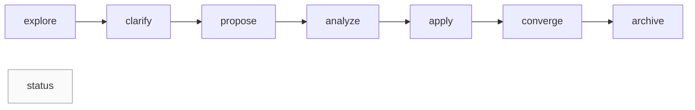

# Specmark — Specification-Driven Change Workflow

> A specification-driven change management skill for AI agents: an eight-stage state machine covering explore → clarify → propose → analyze → apply → converge → archive → status, with stage gating done by deterministic scripts instead of model guesswork.

[](https://github.com/Kirky-X/specmark/releases) [](https://github.com/Kirky-X/specmark/releases) [](LICENSE)

English | [中文](README.md)

## ✨ Features

- **Eight-stage state machine**: `explore` (read-only thinking) → `clarify` (structured clarification, ≤5 high-impact questions, 8-category scan) → `propose` (one-shot proposal + design + tasks) → `analyze` (read-only cross-artifact quality gate) → `apply` (execute tasks.md item by item) → `converge` (reconcile deliverables against spec, append-only gaps) → `archive` (archive) → `status` (read-only status query), routed via `$ARGUMENTS[0]` and natural-language intent.
- **Auto-execution chain with complexity-adaptive short-circuit**: stages auto-link; simple changes short-circuit to propose→apply, judged deterministically by `check_phase.sh complexity`; the user can override explicitly.
- **Delta spec for long-running changes**: when tasks ≥ 5 or spanning ≥ 3 modules, a verifiable spec is generated at `specs/<capability>/spec.md`; `archive --sync` merges it back deterministically via `merge_delta_spec.py`.
- **6 domain types**: code / doc / event / design / research / general — they determine task format, apply strategy, and converge verification; declared via `<!-- domain: <type> -->` in the proposal header.
- **Deterministic scripts (Rule 3)**: task counting, complexity, archive readiness, and reference consistency must be computed by scripts under `scripts/`, never hand-counted by the model.
- **ROOT contract**: scripts run from the user project's cwd; `--root` defaults to the caller's git repository top level automatically.
- **Archive protection**: change-level flock + commit SHA anchoring + `.readonly` sentinel + refusal to overwrite an existing archive target; `--dry-run` preview.
- **Safety valves**: the chain pauses on CRITICAL/HIGH findings in analyze; converge loops past 3 rounds hard-stop; `apply --auto-commit` git-commits after each task (off by default).

## 📦 Installation

No external CLI dependency (pure documentation skill; the scripts only need bash and python3).

```bash
# Option 1: deploy from this workspace (to ~/.zcode/skills and ~/.claude/skills)
bash scripts/sync-skills.sh specmark

# Option 2: manual copy into the ZCode skills directory
cp -r /path/to/specmark ~/.zcode/skills/specmark

# Option 3: remote install from GitHub, for claude-code / codex and other agents
npx skills add Kirky-X/specmark --agent claude-code -y
# Or use the bundled installer (9 agents supported)
git clone https://github.com/Kirky-X/specmark && cd specmark
./scripts/install-skill.sh install specmark --agent claude
```

On reinstall/upgrade the installer protects runtime data: if the target `specmark/changes/` is non-empty it is moved to `changes.bak.<timestamp>/` instead of being silently deleted.

## 🚀 Quick Start

Prerequisite: the skill is installed and loaded by the agent (invoked as `/specmark` in conversation).

```text
/specmark explore            # Read-only exploration: think through ideas, no app code
/specmark propose add-auth   # Generate proposal + design + tasks (delta spec for long-running changes)
/specmark apply              # Execute tasks.md item by item; PAUSE when blocked
/specmark status             # View active changes, progress, and archive overview
```

The deterministic scripts can also be called from the user project root (`$SKILL` is the skill install directory):

```bash
bash $SKILL/scripts/status.sh                            # Global status (--json optional)
bash $SKILL/scripts/check_phase.sh tasks add-auth        # Task completion counts (JSON)
python3 $SKILL/scripts/check_refs.py --root .            # Cross-file reference lint
```

Stage collaboration chain:



The chain is not strictly linear: clarify / analyze / converge can be skipped as needed; short-circuit rules and failure modes are documented in [SKILL.md](SKILL.md) and `references/<subcommand>.md`.

## ✅ Tests & Verification

Verified 2026-09-13 (v0.2.2, matching the git tag):

- **Syntax**: all 4 shell scripts (`archive_change.sh` / `check_phase.sh` / `install-skill.sh` / `status.sh`) pass `bash -n`.
- **Functional** (inside a temporary git project):
  - `check_phase.sh artifacts/tasks/converge-readiness` emit JSON verdicts (e.g. `{"total":3,"completed":1,"all_done":0}`, `{"ready":false,"reason":"2 original tasks still open"}`)
  - `status.sh` prints the active-change table (name / stage / progress / delta spec)
  - `archive_change.sh --dry-run` prints an archive preview (target `specmark/archive/YYYY-MM-DD-<name>/`) without executing
  - Calling `status.sh` from a project subdirectory auto-locates the git repository top level
- `test-prompts.json` stores trigger-phrase cases per subcommand for routing verification.

## 📁 Directory Structure

```
specmark/
├── SKILL.md            # Entry: subcommand routing + auto-chain + anti-pattern blacklist
├── skill.json          # Metadata (name/version/license/repo)
├── references/         # Steps + Guardrails per subcommand (10 files)
│   ├── explore.md … status.md
│   ├── explore-examples.md
│   └── troubleshooting.md
├── scripts/            # Deterministic tools + installer
│   ├── check_phase.sh      # Stage gating (complexity/tasks/converge/archive-readiness/artifacts)
│   ├── status.sh           # Global status query
│   ├── check_refs.py       # Cross-file reference lint
│   ├── archive_change.sh   # Archive executor (flock + read-only enforcement)
│   ├── merge_delta_spec.py # Deterministic delta spec merge
│   └── install-skill.sh    # Multi-agent install/update
└── specmark/           # Runtime working directory (changes/ specs/ archive/)
```

## 🔮 Boundaries

- **Does not trigger**: plain Q&A or direct code generation with no change-management intent. Natural-language intent (e.g. "help me think this through") is first confirmed via AskUserQuestion before entering explore — no silent routing.
- **Sibling skills**: `pangu` scaffolds projects and CI; `diting` reviews code quality; `tiangang` runs security scans. Specmark only manages the change process itself (spec → tasks → apply → converge → archive); it does not build, run tests, or judge quality.
- **Pure documentation skill**: all change-management operations go through the agent's file-system tools; scripts only perform deterministic gating.

## 📄 License & Attribution

MIT License. Originally four separate top-level skills (`specmark-propose` / `specmark-explore` / `specmark-apply-change` / `specmark-archive-change`), flattened into a single skill with the original SKILL.md content moved into `references/`.
