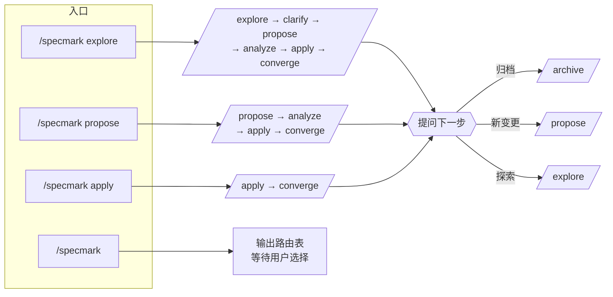
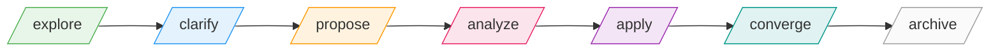
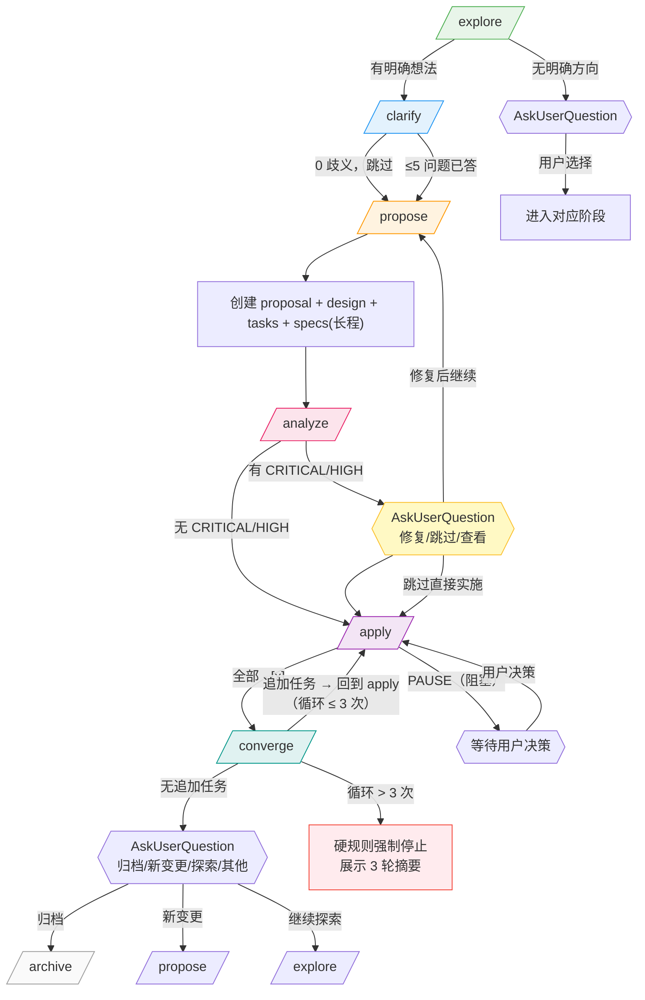

# Specmark 规格驱动变更工作流

通过 `$ARGUMENTS[0]` 选择子命令。每个子命令的完整流程、步骤、Guardrails 在 `references/<子命令>.md`，按需加载。

## 子命令路由

| 参数       | 功能                                                                   | 参考                     |
| ---------- | ---------------------------------------------------------------------- | ------------------------ |
| `explore`  | 探索/思考模式（只读，不写应用代码）                                    | `references/explore.md`  |
| `clarify`  | 结构化澄清，自动链 explore→clarify 衔接点（≤5 高影响问题，8 分类扫描） | `references/clarify.md`  |
| `propose`  | 一步生成 proposal + design + tasks 全套产物（长程变更含 delta spec）   | `references/propose.md`  |
| `analyze`  | 跨产物一致性分析，自动链 propose→analyze 衔接点（只读质量门）          | `references/analyze.md`  |
| `apply`    | 按 tasks.md 实施任务，逐条勾选                                         | `references/apply.md`    |
| `converge` | 收敛：自动链 apply→converge 衔接点，对比代码与 spec，append 缺漏任务   | `references/converge.md` |
| `archive`  | 归档已完成变更（`--sync` 启用 delta spec 同步到主 specs）              | `references/archive.md`  |

**Flags 速查**：

- `apply --auto-commit`：每任务完成后自动 `git commit`（默认关闭，不破现有行为；详见 `references/apply.md`）。
- `archive --sync`：归档时把 delta spec 同步到 `specmark/specs/<cap>/spec.md`（由 `scripts/merge_delta_spec.py` 确定性合并，不启动 LLM；详见 `references/archive.md`）。
- **归档只读**：`specmark/archive/` 由 `scripts/archive_change.sh` 维护 `.readonly` 哨兵 + change 级 flock + commit SHA 锚定；既有归档条目禁止修改，只允许追加。

## 调用示例

## 执行流程

**🔴 CHECKPOINT · 🛑 STOP：解析 `$ARGUMENTS[0]` 后、进入子命令流程前，先确认子命令选择正确（尤其自然语言意图需用 AskUserQuestion 工具与用户确认），避免误路由后回滚成本。**

1. 解析 `$ARGUMENTS[0]`：
   - 合法值（`explore`/`clarify`/`propose`/`analyze`/`apply`/`converge`/`archive`）→ 进入步骤 2
   - 缺失或拼写错误（如 `/specmark`、`/specmark foobar`）→ 输出上方路由表，请用户选择后停止
   - 自然语言意图（如「我还没想好」「帮我梳理思路」「探讨方案」）→ 用 **AskUserQuestion 工具**确认是否进入 `explore`（只读思考模式），不自动路由也不直接列表
2. **Read `references/<子命令>.md`**，按其 Steps + Guardrails 执行。
3. 所有变更管理操作（创建 change 目录、读取任务状态、归档）通过 AI agent 的文件系统工具（mkdir/Write/Read/Glob/mv）直接操作 `specmark/` 工作目录完成。

## 子命令选用指南

| 用户意图                                    | 子命令     |
| ------------------------------------------- | ---------- |
| "我想做 X / 加个功能" → 生成完整提案        | `propose`  |
| "帮我梳理这个想法 / 探讨方案 / 对比选项"    | `explore`  |
| "需求里有模糊点 / 先问清楚再提案"           | `clarify`  |
| "提案生成后 / 检查产物一致性 / 质量门"      | `analyze`  |
| "开始实施 / 做下一个任务 / 继续这个 change" | `apply`    |
| "实施完了 / 对比代码和 spec / 补漏"         | `converge` |
| "这个 change 做完了 / 归档 / 收尾"          | `archive`  |
| "我还没想好 / 先聊聊"                       | `explore`  |

> **注意：** 自动链生效时，输入 `explore` 会依次自动执行 clarify → propose → analyze → apply → converge → 提问下一步。用户可在任意阶段发出新指令中断链路。

## 阶段协作链路

> 非强制线性：clarify / analyze / converge 可按需跳过。自动链中见下方衔接规则。

## 自动执行链

阶段之间存在自动衔接。每个阶段完成时，自动启动下一个阶段，**不等待用户确认**：

**手动调用仍有效。** 自动链不阻止用户显式调用任一子命令（如 `/specmark analyze` 独立运行）。

**自动链中的阶段仍遵循各自的 Guardrails。** 例如 clarify 发现 0 个歧义时跳过（announce"无需澄清"后继续 propose）；analyze 无 CRITICAL/HIGH 发现时报告通过后继续。

### 自动链失败模式

| 阶段              | 失败条件                                                 | 处理                                                                                         |
| ----------------- | -------------------------------------------------------- | -------------------------------------------------------------------------------------------- |
| explore → clarify | explore 未产出明确想法（开放式讨论、多方向并存）         | 不自动进 clarify；用 AskUserQuestion 问用户下一步                                            |
| clarify → propose | clarify 仍有 4+ 未答分类                                 | 不自动进 propose；展示已捕获的澄清 + 未答分类，用 AskUserQuestion 补问或用默认值继续         |
| propose → analyze | propose 产物创建失败（如目录写入错误）                   | 报错停止，不进 analyze；提示用户检查权限或路径                                               |
| analyze → apply   | analyze 发现 CRITICAL 级问题                             | 暂停自动链；展示报告；用 AskUserQuestion 问：修复后继续 / 跳过直接实施 / 查看报告            |
| apply → converge  | apply 有任务被 PAUSE（阻塞/不清）                        | 不自动进 converge；展示暂停原因，等待用户决策                                                |
| converge → 提问   | converge 追加任务后回到 apply，循环 **> 3 次**仍有新缺口 | **硬规则强制停止**；展示 3 轮摘要；用 AskUserQuestion 问用户：接受当前状态 / 手动介入 / 暂停 |
| 任意阶段          | 用户在阶段执行中发出新指令                               | 立即停止当前阶段，响应用户新指令                                                             |

**链路终止后：** converge 完成后（或 apply 后无需 converge 时），主动向用户提问下一步操作，不结束对话。可用选项：

- 归档此变更（`/specmark archive`）
- 开始新变更
- 继续探索其他方向
- 其他操作

**用户可随时中断自动链。** 阶段执行中用户发出新指令时，立即停止当前阶段并响应用户。

## 不要做什么（反例黑名单）

下列反模式会破坏 spec-driven 工作流的可追溯性与一致性，执行任何子命令前对照检查。

| #   | 反模式                                                 | 为什么不要做                                                        | 正确做法                                                                           |
| --- | ------------------------------------------------------ | ------------------------------------------------------------------- | ---------------------------------------------------------------------------------- |
| 1   | 在 `explore` 模式写应用代码                            | explore 是只读思考模式；写代码会让"探索"变成"实施"，破坏阶段边界    | 想清楚后退出 explore，用 `propose` 落地变更，再 `apply` 实施                       |
| 2   | 跳过 `propose` 直接 `apply`                            | 没有 proposal/design/tasks 就实施，spec 失去追溯依据，converge 失效 | 先 `/specmark propose` 生成全套产物（长程变更含 delta spec），再 `/specmark apply` |
| 3   | 修改已归档的 change（`specmark/archive/` 下文件）      | 归档是只读历史；改动归档会让 spec 与历史代码脱钩                    | 新建 change 处理后续变更；归档内容只读                                             |
| 4   | `apply` 跳过未完成任务直接做下一个                     | 顺序执行是硬约束；跳过会让下游任务依赖缺失                          | 严格按 `tasks.md` 顺序；遇阻则 PAUSE，不跳过                                       |
| 5   | `converge` 改写已有任务而非 append                     | append-only 是硬约束；改写会让历史任务不可追溯                      | 仅在 `## Phase N: Convergence` 段追加新任务                                        |
| 6   | 在 `tasks.md` 留 `TBD` / `TODO` / "as needed" 等占位符 | 占位符让 apply 中途停滞；任务必须可执行                             | 拆为具体子任务，或写到 `proposal.md` 的 `## NEEDS CLARIFICATION`                   |
