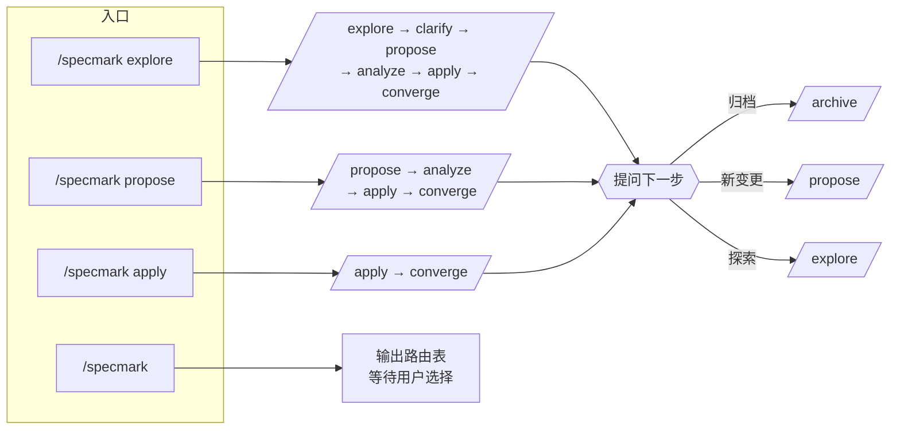
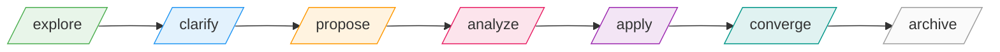
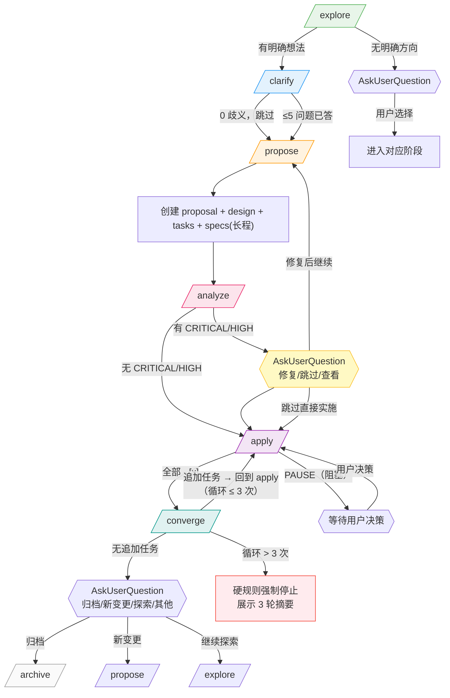

# Specmark 规格驱动变更工作流

通过 `$ARGUMENTS[0]` 选择子命令。每个子命令的完整流程、步骤、Guardrails 在 `references/<子命令>.md`，按需加载。

## 子命令路由

| 参数       | 功能                                                                   | 参考                     |
| ---------- | ---------------------------------------------------------------------- | ------------------------ |
| `explore`  | 探索/思考模式（只读，不写应用代码）                                    | `references/explore.md`  |
| `clarify`  | 结构化澄清，自动链 explore→clarify 衔接点（≤5 高影响问题，8 分类扫描） | `references/clarify.md`  |
| `propose`  | 一步生成 proposal + design + tasks 全套产物（长程变更含 delta spec）   | `references/propose.md`  |
| `analyze`  | 跨产物一致性分析，自动链 propose→analyze 衔接点（只读质量门）          | `references/analyze.md`  |
| `apply`    | 按 tasks.md 实施任务，逐条勾选                                         | `references/apply.md`    |
| `converge` | 收敛：自动链 apply→converge 衔接点，对比交付物与 spec，append 缺漏任务   | `references/converge.md` |
| `archive`  | 归档已完成变更（`--sync` 启用 delta spec 同步到主 specs）              | `references/archive.md`  |
| `status`   | 只读查询活动变更与历史归档概览                                          | `references/status.md`   |

> 深入参考：探索模式的 5 步系统法与深度研究子模式详见 `references/explore-examples.md`。

**Flags 速记**：

- `apply --auto-commit`：每任务完成后自动 `git commit`（仅提交本任务改动的代码文件，不提交 `specmark/` 路径——与「归档才入库」的约定兼容；默认关闭，详见 `references/apply.md`）。
- `archive --sync`：归档时把 delta spec 同步到 `specmark/specs/<cap>/spec.md`（由 `$SKILL/scripts/merge_delta_spec.py` 确定性合并，不启动 LLM；详见 `references/archive.md`）。
- `archive --allow-unfinished`：带未完成任务/缺失产物归档（**必须先经用户 AskUserQuestion 确认**），豁免快照记入 meta.json（详见 `references/archive.md`）。
- **归档只读**：`specmark/archive/` 由 `$SKILL/scripts/archive_change.sh` 维护 change 级 fcntl 进程锁 + commit SHA 锚定，并以 `.readonly` 哨兵文件作为只读**约定**标记（实际强制约束由「拒绝覆盖同名归档目标」实现）；既有归档条目禁止修改，只允许追加。误归档用 `archive_change.sh restore <archive-name>` 恢复（见 `references/troubleshooting.md`），**禁止手动 mv**。
- **归档预览**：`archive --dry-run` 预览归档结果而不执行实际操作（详见 `references/archive.md`）。
- **确定性工具（必须调用，禁止手动替代）**。约定：下文 `$SKILL` 指本 skill 的安装目录（如 `~/.zcode/skills/specmark`）；脚本从用户项目 cwd 调用，`--root` 缺省时自动取调用方 cwd 所在 git 仓库顶层。判定实现统一在 `$SKILL/scripts/specmark_state.py`（单一谓词源），`.sh` 为薄入口：

  | 脚本 | 用途 | 何时调用 | 子命令 / 主要参数 |
  |------|------|----------|------------------|
  | `$SKILL/scripts/check_phase.sh` | 阶段完成确定性判定 + 三档复杂度 | propose/apply/converge/archive 各阶段 | `complexity` / `tasks` / `converge-readiness` / `archive-readiness` / `artifacts`；`--json` 静默人类摘要 |
  | `$SKILL/scripts/status.sh` | 全局状态查询（含 next_command 确定性路由） | status 子命令 | `--json` 可选 |
  | `$SKILL/scripts/check_refs.py` | 引用与产物 lint | analyze 阶段用 `--project <用户项目>`；修改 skill 自身文档后用 `--skill-root <skill 仓库>` | `--json` / `--verbose` |
  | `$SKILL/scripts/archive_change.sh` | 归档 / 恢复执行器（fcntl 锁 + 只读强制 + 完整性门禁） | archive 子命令步骤 5；误归档恢复 | `--sync` / `--date` / `--dry-run` / `--allow-unfinished`；`restore <archive-name>` |
  | `$SKILL/scripts/merge_delta_spec.py` | delta spec 确定性合并 | archive --sync 时由 archive_change.sh 自动调用 | `--main` / `--delta` / `--out` / `--dry-run` |

  > **规则 3 对齐**：上述脚本覆盖的判定逻辑（任务计数、复杂度评估、归档就绪、引用一致性、阶段推断）属于确定性逻辑，禁止 agent 手动读文件后自行计算。脚本判定不通过时按输出的 `remedy` 字段行动，不自行读文件重判。

## Domain（领域类型）

每个 specmark 变更都属于一个领域（domain）。domain 决定任务格式、apply 执行策略和 converge 验证方式。

| domain | 含义 | 交付物标识示例 |
|--------|------|----------------|
| `code` | 软件开发（默认） | `src/auth/login.ts` |
| `doc` | 文档/内容创作 | `docs/chapter-3.md` |
| `event` | 活动策划/执行 | `venue-contract-signed` |
| `design` | 设计项目 | `designs/homepage-v2.fig` |
| `research` | 研究项目 | `research/market-analysis.md` |
| `general` | 通用 | `stakeholder-approval` |

**声明方式**：在 proposal.md 头部加 `<!-- domain: <type> -->`（HTML 注释，不影响渲染）。

无显式声明时一律按 `code` 处理，脚本不做自动推断。

## 调用示例

```mermaid
flowchart LR
    subgraph 入口
        U1["/specmark explore"]
        U2["/specmark propose <name>"]
        U3["/specmark apply"]
        U4["/specmark"]
    end

    U1 --> E[/"explore → clarify → propose\n→ analyze → apply → converge"/]
    U2 --> P[/"propose → analyze\n→ apply → converge"/]
    U3 --> A[/"apply → converge"/]
    U4 --> R["输出路由表\n等待用户选择"]

    E --> ASK{{"提问下一步"}}
    P --> ASK
    A --> ASK

    ASK -->|"归档"| AR[/"archive"/]
    ASK -->|"新变更"| NP[/"propose"/]
    ASK -->|"探索"| NE[/"explore"/]
```

## 执行流程

**🔴 CHECKPOINT · 🛑 STOP：解析 `$ARGUMENTS[0]` 后、进入子命令流程前，先确认子命令选择正确（尤其自然语言意图需用 AskUserQuestion 工具与用户确认），避免误路由后回滚成本。**

1. 解析 `$ARGUMENTS[0]`：
   - 合法值（`explore`/`clarify`/`propose`/`analyze`/`apply`/`converge`/`archive`/`status`）→ 进入步骤 2
   - 缺失或拼写错误（如 `/specmark`、`/specmark foobar`）→ 输出上方路由表，请用户选择后停止
   - 自然语言意图（如「我还没想好」「帮我梳理思路」「探讨方案」）→ 用 **AskUserQuestion 工具**确认是否进入 `explore`（只读思考模式），不自动路由也不直接列表
   - `status` → Read `references/status.md`，运行 `$SKILL/scripts/status.sh` 展示状态后停止（不进入自动链）
2. **Read `references/<子命令>.md`**，按其 Steps + Guardrails 执行。
3. 所有变更管理操作（创建 change 目录、读取任务状态、归档）通过 AI agent 的文件系统工具（mkdir/Write/Read/Glob/mv）直接操作 `specmark/` 工作目录完成。**阶段判定与状态计算必须调用 `scripts/` 下的确定性脚本**，不由 agent 手动读文件后计算。各阶段脚本调用点：

   | 阶段 | 必须调用的脚本 |
   |------|------------------|
   | propose | `$SKILL/scripts/check_phase.sh complexity <name>`（产物完成后三档判定，见「自动链短路」节） |
   | apply | `$SKILL/scripts/check_phase.sh tasks <name>`（检查状态 + 显示进度，含阻塞与收敛轮数） |
   | converge | `$SKILL/scripts/check_phase.sh converge-readiness <name>`（验证 apply 完成） |
   | archive | `$SKILL/scripts/check_phase.sh artifacts <name>` + `$SKILL/scripts/check_phase.sh archive-readiness <name>` + `$SKILL/scripts/archive_change.sh`（执行归档） |
   | analyze | `$SKILL/scripts/check_refs.py --project <project-root>`（产物任务 lint：占位符/ID 格式/路径存在性） |
   | status | `$SKILL/scripts/status.sh`（全局状态查询） |

## 子命令选用指南

| 用户意图                                    | 子命令     |
| ------------------------------------------- | ---------- |
| "我想做 X / 加个功能" → 生成完整提案        | `propose`  |
| "帮我梳理这个想法 / 探讨方案 / 对比选项"    | `explore`  |
| "需求里有模糊点 / 先问清楚再提案"           | `clarify`  |
| "提案生成后 / 检查产物一致性 / 质量门"      | `analyze`  |
| "开始实施 / 做下一个任务 / 继续这个 change" | `apply`    |
| "实施完了 / 对比交付物和 spec / 补漏"         | `converge` |
| "这个 change 做完了 / 归档 / 收尾"          | `archive`  |
| "当前状态 / 有哪些变更 / 进度如何"             | `status`   |
| "我还没想好 / 先聊聊"                       | `explore`  |

> **注意：** 自动链生效时，输入 `explore` 会依次自动执行 clarify → propose → analyze → apply → converge → 提问下一步。用户可在任意阶段发出新指令中断链路。

## 阶段协作链路

```mermaid
flowchart LR
    E[/"explore"/] --> C[/"clarify"/]
    C --> P[/"propose"/]
    P --> A[/"analyze"/]
    A --> Ap[/"apply"/]
    Ap --> Co[/"converge"/]
    Co --> Ar[/"archive"/]

    style E fill:#e8f5e9,stroke:#4caf50
    style C fill:#e3f2fd,stroke:#2196f3
    style P fill:#fff3e0,stroke:#ff9800
    style A fill:#fce4ec,stroke:#e91e63
    style Ap fill:#f3e5f5,stroke:#9c27b0
    style Co fill:#e0f2f1,stroke:#009688
    style Ar fill:#fafafa,stroke:#9e9e9e
```

> 非强制线性：clarify / analyze / converge 可按需跳过。自动链中见下方衔接规则。

## 自动执行链

阶段之间存在自动衔接。每个阶段完成时，自动启动下一个阶段，**不等待用户确认**：

```mermaid
flowchart TD
    E[/"explore"/] -->|"有明确想法"| C[/"clarify"/]
    E -->|"无明确方向"| UQ{{"AskUserQuestion"}}
    C -->|"0 歧义，跳过"| P
    C -->|"≤5 问题已答"| P[/"propose"/]
    P --> D["创建 proposal + design + tasks + specs(长程)"]
    D --> An[/"analyze"/]
    An -->|"无 CRITICAL/HIGH"| Ap[/"apply"/]
    An -->|"有 CRITICAL/HIGH"| CR{{"AskUserQuestion\n修复/跳过/查看"}}
    CR --> Ap
    Ap -->|"全部 - [x]"| Co[/"converge"/]
    Ap -->|"PAUSE（阻塞）"| WAIT{{"等待用户决策"}}
    Co -->|"无追加任务"| ASK{{"AskUserQuestion\n归档/新变更/探索/其他"}}
    Co -->|"追加任务 → 回到 apply\n（循环 ≤ 3 次）"| Ap
    Co -->|"循环 > 3 次"| STOP["硬规则强制停止\n展示 3 轮摘要"]

    UQ -->|"用户选择"| E2["进入对应阶段"]
    CR -->|"修复后继续"| P
    CR -->|"跳过直接实施"| Ap
    WAIT -->|"用户决策"| Ap
    ASK -->|"归档"| Ar[/"archive"/]
    ASK -->|"新变更"| P2[/"propose"/]
    ASK -->|"继续探索"| E3[/"explore"/]

    style E fill:#e8f5e9,stroke:#4caf50
    style C fill:#e3f2fd,stroke:#2196f3
    style P fill:#fff3e0,stroke:#ff9800
    style An fill:#fce4ec,stroke:#e91e63
    style Ap fill:#f3e5f5,stroke:#9c27b0
    style Co fill:#e0f2f1,stroke:#009688
    style Ar fill:#fafafa,stroke:#9e9e9e
    style CR fill:#fff9c4,stroke:#fbc02d
    style STOP fill:#ffebee,stroke:#f44336
```

**手动调用仍有效。** 自动链不阻止用户显式调用任一子命令（如 `/specmark analyze` 独立运行）。

**自动链中的阶段仍遵循各自的 Guardrails。** 例如 clarify 发现 0 个歧义时跳过（announce"无需澄清"后继续 propose）；analyze 无 CRITICAL/HIGH 发现时报告通过后继续。

### 自动链失败模式

| 阶段              | 失败条件                                                 | 处理                                                                                         |
| ----------------- | -------------------------------------------------------- | -------------------------------------------------------------------------------------------- |
| explore → clarify | explore 未产出明确想法（开放式讨论、多方向并存）         | 不自动进 clarify；用 AskUserQuestion 问用户下一步                                            |
| clarify → propose | clarify 仍有 4+ 未答分类                                 | 不自动进 propose；展示已捕获的澄清 + 未答分类，用 AskUserQuestion 补问或用默认值继续         |
| propose → analyze | propose 产物创建失败（如目录写入错误）                   | 报错停止，不进 analyze；提示用户检查权限或路径                                               |
| analyze → apply   | analyze 发现 CRITICAL 级问题                             | 暂停自动链；展示报告；用 AskUserQuestion 问：修复后继续 / 跳过直接实施 / 查看报告            |
| apply → converge  | apply 有任务被 PAUSE（阻塞/不清）                        | 不自动进 converge；展示暂停原因，等待用户决策                                                |
| converge → 提问   | converge 追加任务后回到 apply，收敛轮数（脚本 `tasks` 输出的 `convergence_rounds` 计数）**> 3** 仍有新缺口 | **硬规则强制停止**；展示 3 轮摘要；用 AskUserQuestion 问用户：接受当前状态 / 手动介入 / 暂停 |
| 任意阶段          | 用户在阶段执行中发出新指令                               | 立即停止当前阶段，响应用户新指令                                                             |

> 更多工作流故障场景与恢复方法（apply 中途发现 design 有误、误归档回滚等）详见 `references/troubleshooting.md`。

**链路终止后：** converge 完成后（或 apply 后无需 converge 时），主动向用户提问下一步操作，不结束对话。可用选项：

- 归档此变更（`/specmark archive`）
- 开始新变更
- 继续探索其他方向
- 其他操作

**用户可随时中断自动链。** 阶段执行中用户发出新指令时，立即停止当前阶段并响应用户。

### 自动链短路（复杂度自适应，两段式协议）

完整七阶段适合复杂变更，但对简单变更（单文件、<3 行改动、typo 修复）过重。复杂度判定分**两段**——判定必须落在有产物可判的时点，此前只有模型启发式可用：

**第一段：链启动时启发式预判（explore/clarify 衔接点，模型判断）**

此时尚无 change 目录与产物，`check_phase.sh complexity` 无从运行。由 agent 按**规模信号**粗粒度预判（用户描述涉及单文件、typo 级、<3 行改动 → 预判「简单」，可跳过 clarify 直入 propose）。这是唯一允许的模型侧复杂度判断，**必须在输出中显式标注**「启发式预判：简单/中等/复杂」。

**第二段：propose 后脚本三档判定（唯一机制承载）**

propose 产物完成后**必须**调用 `check_phase.sh complexity <name>`（规则 3）。输出三档，对齐链路表：

| 档位 | 判定条件（脚本确定性计算） | 链路承载 |
|------|---------------------------|----------|
| **simple** | 任务数 ≤2 且模块数 ≤1 且非多域 | propose 后跳过 analyze/converge，直接 apply（clarify 已在第一段预判跳过） |
| **medium** | 非 simple 且非 complex | `propose` → `analyze` → `apply` → `converge`（无 delta spec） |
| **complex** | 任务数 ≥5 或模块数 ≥3 或 proposal Scope 跨多个能力域 | 完整链路 + 自动生成 delta spec（见 propose.md 4c） |

**两段不一致时的硬规则**：第一段预判「简单」但脚本判定 ≥ medium → **必须补跑 analyze**，不沿用预判短路；脚本判定永远优先于预判。

**用户可显式覆盖**：如「我知道这很简单，但走完整流程」→ 强制完整链路；或「这个很复杂但直接做」→ 强制短路。

**短路不跳过 apply 的关键审查**（`references/apply.md` 实施前 4 项检查始终执行）。

## 不要做什么（反例黑名单）

下列反模式会破坏 spec-driven 工作流的可追溯性与一致性，执行任何子命令前对照检查。

| #   | 反模式                                                 | 为什么不要做                                                        | 正确做法                                                                           |
| --- | ------------------------------------------------------ | ------------------------------------------------------------------- | ---------------------------------------------------------------------------------- |
| 1   | 在 `explore` 模式写应用代码                            | explore 是只读思考模式；写代码会让"探索"变成"实施"，破坏阶段边界    | 想清楚后退出 explore，用 `propose` 落地变更，再 `apply` 实施                       |
| 2   | 跳过 `propose` 直接 `apply`                            | 没有 proposal/design/tasks 就实施，spec 失去追溯依据，converge 失效 | 先 `/specmark propose` 生成全套产物（长程变更含 delta spec），再 `/specmark apply` |
| 3   | 修改已归档的 change（`specmark/archive/` 下文件），或误归档后手动 `mv` 回滚 | 归档是只读历史；手动 mv 绕过锁与只读强制，改动归档会让 spec 与历史代码脱钩 | 新建 change 处理后续变更；归档内容只读；**误归档用 `archive_change.sh restore <archive-name>` 恢复** |
| 4   | `apply` 跳过未完成任务直接做下一个                     | 顺序执行是硬约束；跳过会让下游任务依赖缺失                          | 严格按 `tasks.md` 顺序；遇阻则 PAUSE，不跳过                                       |
| 5   | `converge` 改写已有任务而非 append                     | append-only 是硬约束；改写会让历史任务不可追溯                      | 仅在 `## Phase N: Convergence` 段追加新任务                                        |
| 6   | 在 `tasks.md` 留 `TBD` / `TODO` / "as needed" 等占位符 | 占位符让 apply 中途停滞；任务必须可执行                             | 拆为具体子任务，或写到 `proposal.md` 的 `## NEEDS CLARIFICATION`                   |
| 7   | 手动读文件计算任务数/复杂度/归档就绪状态，或用链启动预判代替脚本判定 | 违反规则 3（确定性逻辑禁止交给模型）；agent 计数可能出错。唯一例外：自动链启动时（产物尚不存在）的规模信号**启发式预判**，且须显式标注、propose 后以脚本判定为准 | 调用 `$SKILL/scripts/check_phase.sh` 对应子命令获取 JSON 结果，非 0 按 `remedy` 行动 |
| 8   | 非 coding 场景用 code 域格式写任务                     | 交付物标识格式不匹配导致 apply 无法执行、converge 无法对账        | propose 时声明 `<!-- domain: <type> -->`，用对应域的交付物标识格式（见 propose.md） |
